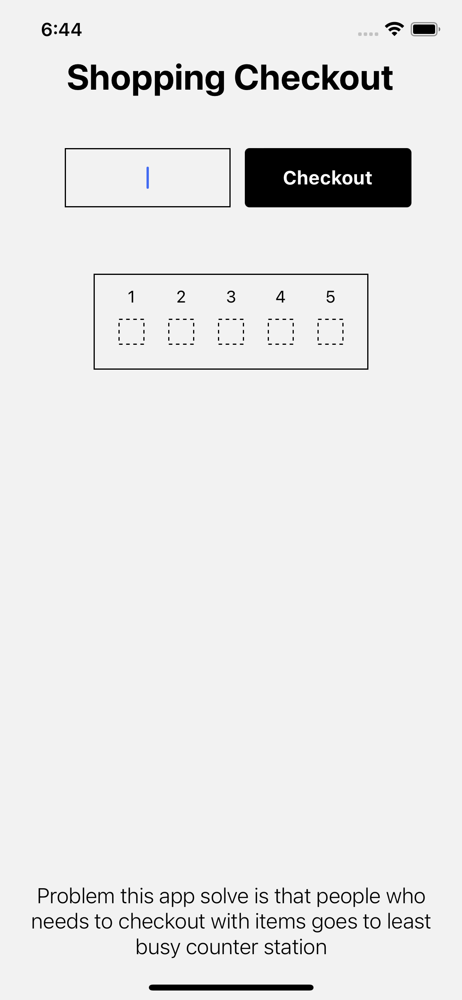

# ShoppingCheckoutProblem

### Setup IOS
```bash
yarn
cd ios
npx pod-install
cd ..
yarn ios
```

## Problem 

The objective is to create a mobile application that assists users in finding the least busy counter station for checkout when they have items to purchase. The application should provide users with information about the number of people in line and the items to be checked out at each of the five available checkpoint stations. Users must select the least busy counter station to minimize the time spent waiting in line.


